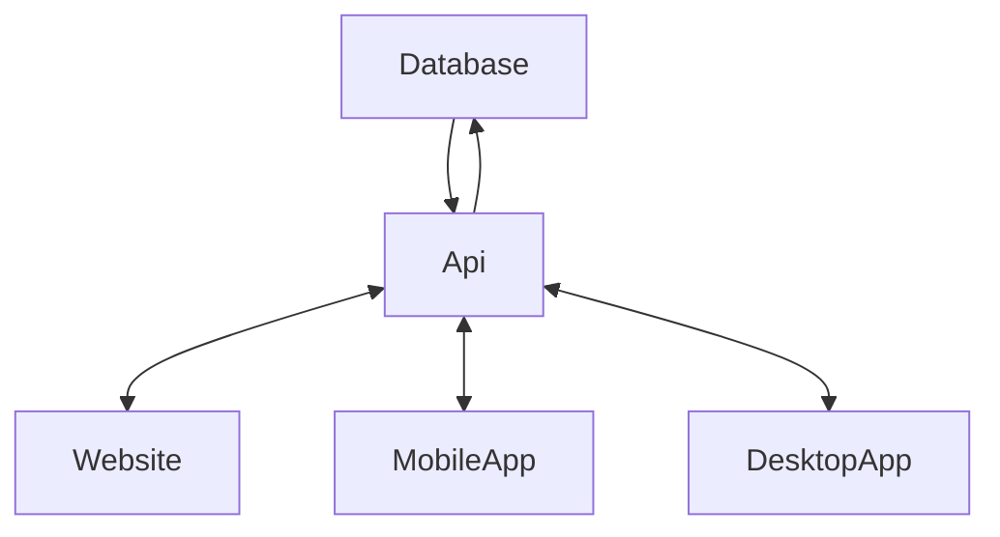
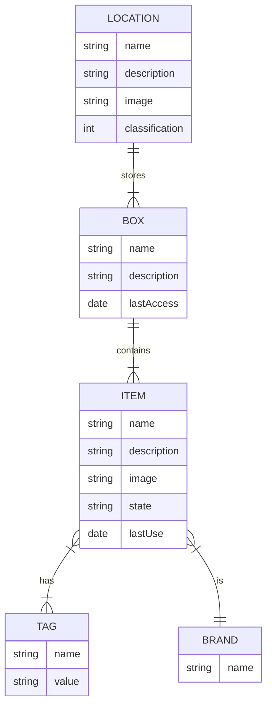

# storganizer

## Early sneak peak
```
git clone git@github.com:claudio-walser/storganizer.git
cd storganizer/api
python api.py # sorry no requirements.txt right now, flask and stuff is needed - sorry again

# in a second terminal
cd storganizer/ui
npm install
npm run start
```
A webbrowser should open and you should hopefully be greeted with with the application

## Description
Application to manage your storage at home. It is really not much more than an idea.
I did not find anything simple to digitally manage my mess at home. Everything I own is of unimaginable value of course.

I want to classify my storage possibilities based on accessibility. Most accessible will be 1, next is 2 and so on.
Then, I want to mark my boxes with QR codes and add what items are in there.

[ ] Items can optionally also have QR codes.

[ ] The app should be able to scan a QR code and then act.

With boxes:
 - [ ] set an action with a related item, possibly "store" or "take"
 - [ ] set a last access date

 With items:
 - [ ] check the state "stored" or "taken"
 - [ ] check details anyway
 - [ ] perform action, possibly "store" or "take", maybe "relocate" to store it in a different box
 - [ ] set a last usage date

Items without QR codes, for whatever reason, can still change state by scanning the boxes QR code. This might get hard to use having alot of items in one box. Time will tell.


## Repositories
 In the future, I see 3 or 4 repos:
 - api
 - mobile-app
 - web-app
 - desktop-app (dont judge, since my pinephone pro does not yet support aosp, I do need kind of a native linux app)

Right now, I am going to do everything just in here.

## High Level Architecture



## Data Structure




## Planned Features
- [x] QR Codes or NFC Tags on boxes to check what is in there
- [x] QR Codes or NFC Tags to identify an object
- [x] Search function for items by brand, tags, fulltext search to identify an object
- [x] Possibility to find identified objects or check where there belong to
