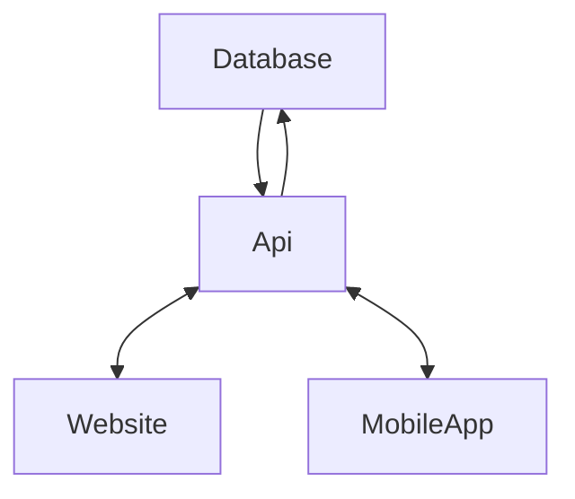
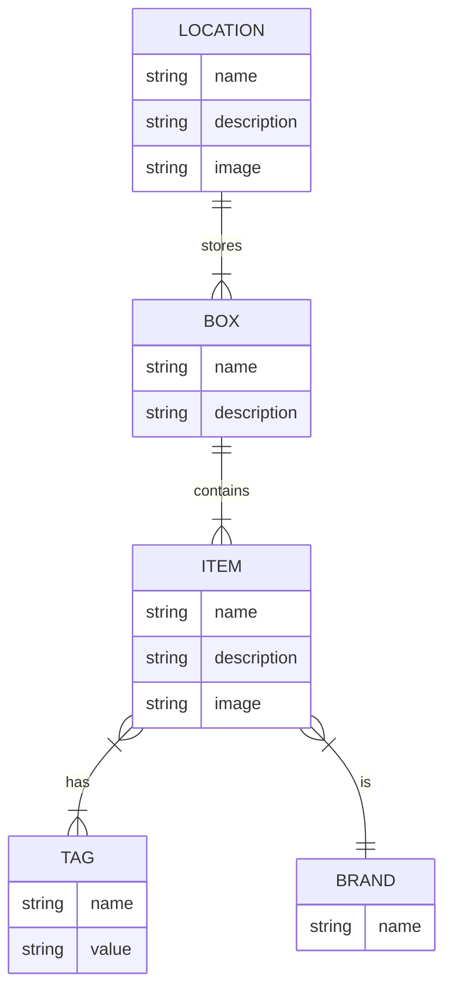

# storganizer
Application to manage your storage at home

## High Level Architecture

## Data Structure

## Planned Features
- QR Codes or NFC Tags on boxes to check what is in there
- QR Codes or NFC Tags to identify an object
- Search function for items by brand, tags, fulltext search to identify an object
- Possibility to find identified objects or check where there belong to 